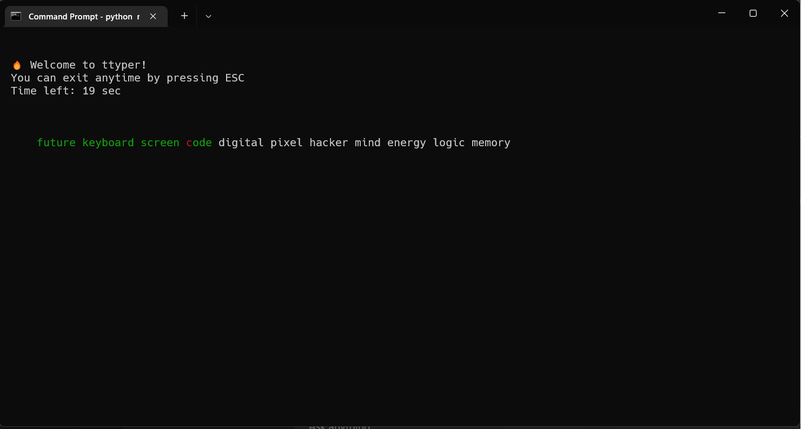
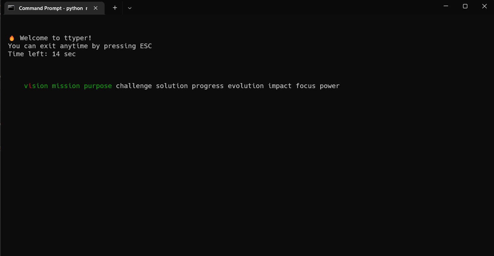
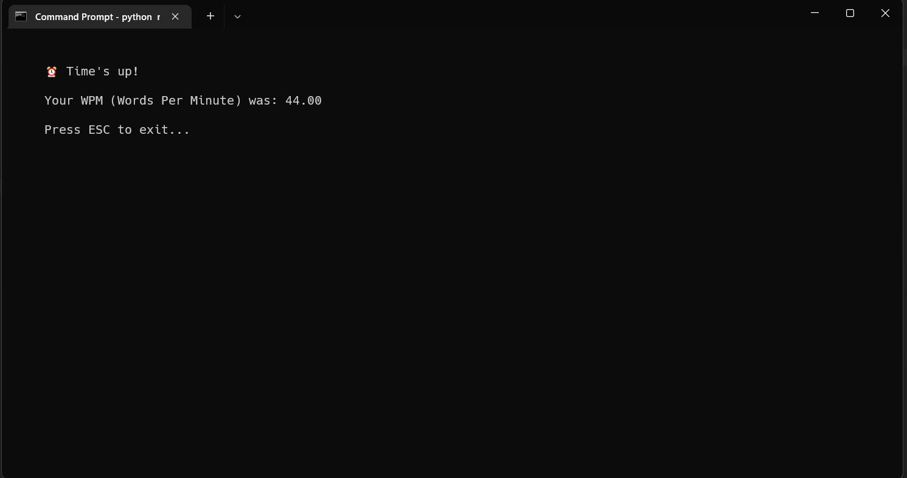

# 🧠 ttyper

**ttyper** is a terminal-based typing game inspired by MonkeyType — minimal, fast, and built for hackers who love the command line.



## 🚀 Features

- ⌨️ Typing practice right from your terminal
- 🧾 Long and short phrases loaded from `phrases/data.json`
- 🌈 Real-time feedback with colors:
  - Green = correct
  - Red = mistake
  - White = pending
- ⏱️ 30-second timer + WPM calculation
- 🏃 Escape anytime by pressing `ESC`
- 📦 Clean and dependency-free (only uses built-in `curses`)

## 📷 Screenshots

<p align="center">
  
  
</p>

## 🛠️ Usage

```bash
python main.py
